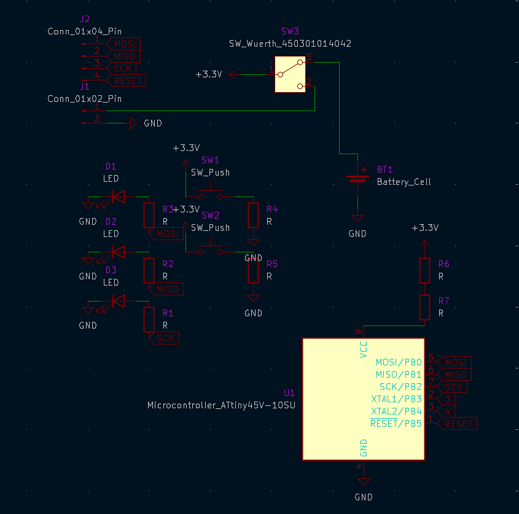
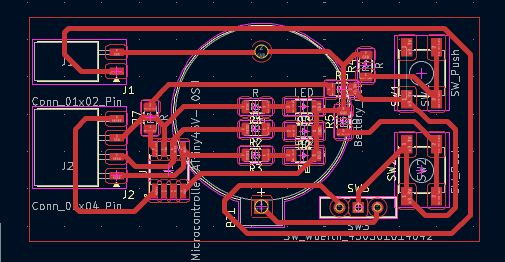

# Creación de PCBs

## Proyecto: secuencia de tres LEDs

Esta placa utiliza un microcontrolador ATtiny45V para controlar tres LEDs. Al accionar un pulsador, los LEDs se encienden secuencialmente, uno por uno. El interruptor mecánico conecta o desconecta la alimentación.

La secuencia avanza una posición por cada pulsación: se enciende el siguiente LED y los otros dos quedan apagados. El programa del ATtiny45V se cargó usando un Arduino.

## Materiales

- 1 microcontrolador ATtiny45V.
- 1 batería tipo reloj; modelo y tensión por confirmar.
- 1 interruptor mecánico Würth.
- 1 conector hembra de 6 pines.
- 5 resistencias de 220 ohmios.
- 2 pulsadores genéricos.
- 3 LEDs.

## Funcionamiento

1. El interruptor mecánico conecta la batería y alimenta el circuito.
2. Al presionar el pulsador de avance, el ATtiny45V pasa al LED siguiente.
3. Solo queda encendido el LED seleccionado; los otros dos se apagan.
4. La secuencia recorre LED 1, LED 2 y LED 3. El comportamiento después del tercer LED depende del programa cargado.
5. El segundo pulsador también forma parte del circuito; su función debe confirmarse con el esquema o el programa.

## Programación del ATtiny45V con Arduino

El programa se puede escribir y compilar en Arduino IDE. Para cargarlo se necesita un núcleo de placas que incluya el ATtiny45V y un programador ISP; un Arduino Uno puede funcionar como Arduino as ISP.

1. Instala en Arduino IDE un core compatible con ATtiny45/45V y selecciona el modelo y la frecuencia que correspondan a la configuración del microcontrolador.
2. Si usas un Arduino Uno como programador, carga primero el ejemplo **ArduinoISP** en el Uno.
3. Conecta el Uno al ATtiny45V mediante las señales ISP: RESET, MOSI, MISO, SCK, alimentación y GND. Consulta el pinout de ambos dispositivos y el esquema de esta placa antes de cablear.
4. En Arduino IDE, selecciona el ATtiny45V, la frecuencia y **Arduino as ISP** como programador. Si hace falta configurar los fusibles o la fuente de reloj, usa **Burn Bootloader**; esto configura el chip y no significa que necesite un bootloader para funcionar.
5. Carga el sketch mediante **Upload Using Programmer** y prueba la placa.

En el programa, configura los pines de los tres LEDs como salidas y el del pulsador como entrada según el circuito. En cada pulsación válida, incrementa la posición, apaga los tres LEDs y enciende únicamente el correspondiente a la nueva posición. Añade antirrebote (debounce) para que una sola pulsación mecánica no avance varias posiciones. Los números de pin y el modo de entrada deben tomarse del esquema; no están especificados aquí.

Al programar, comprueba la tensión de alimentación permitida por el ATtiny45V y por la batería. No conectes a la vez una alimentación externa y los 5 V del Arduino sin verificar que el circuito lo admite.

## Archivos del proyecto

### Esquema electrónico

### Diseño de la PCB

### Visor 3D

<section class="pcb-stl-viewer" data-stl-viewer data-model-url="{{ '/assets/3d/ATT63634.glb' | relative_url }}" aria-label="Visor interactivo del PCB">
	

		<canvas class="pcb-stl-viewer__canvas" aria-label="Modelo 3D de la PCB" role="img"></canvas>
		
Cargando el modelo 3D...

	

	

		<button type="button" data-viewer-action="zoom-out" aria-label="Alejar" title="Alejar">−</button>
		<button type="button" data-viewer-action="zoom-in" aria-label="Acercar" title="Acercar">+</button>
		<button type="button" data-viewer-action="reset" aria-label="Restablecer vista" title="Restablecer vista">Restablecer vista</button>
		<a class="pcb-stl-viewer__download" href="{{ '/assets/3d/ATT63634.glb' | relative_url }}" download>Descargar GLB</a>
	

</section>

El modelo GLB permite visualizar la geometría y los materiales del diseño 3D con mejor resultado visual en la web; para fabricar una placa electrónica normalmente se necesitan archivos Gerber.

## Notas de revisión

- Confirmar el modelo y la tensión de la batería tipo reloj y que pueda alimentar el circuito.
- Verificar la conexión del ATtiny45V, la polaridad de los LEDs y el orden de pines del conector.
- Confirmar en el esquema cómo se usan las cinco resistencias y cuál es la función del segundo pulsador.
- Comprobar que cada LED tenga una resistencia limitadora en serie y que sus corrientes estén dentro de los límites de los componentes.

## Siguiente sección

- [Modelado de Robot 3D](06-modelado-de-robot-3d.md)
- [Inicio](index.md)